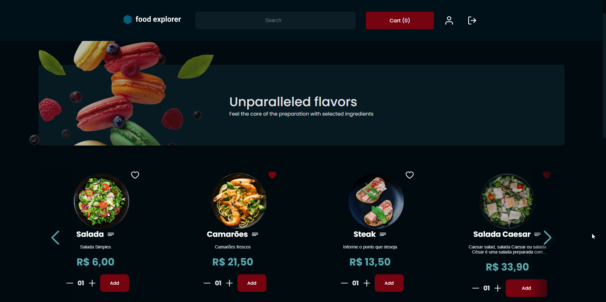
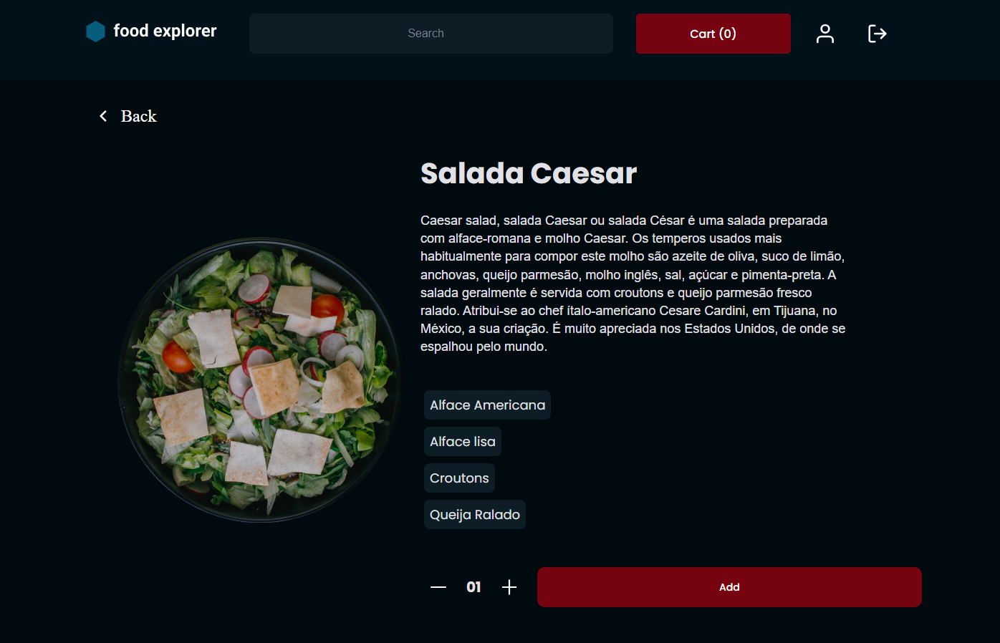
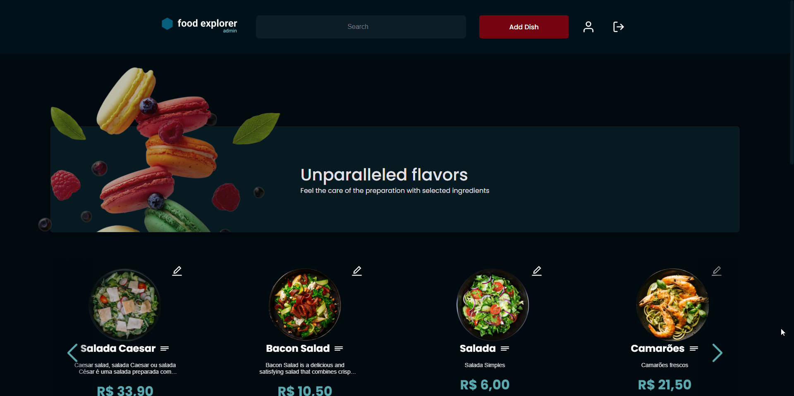
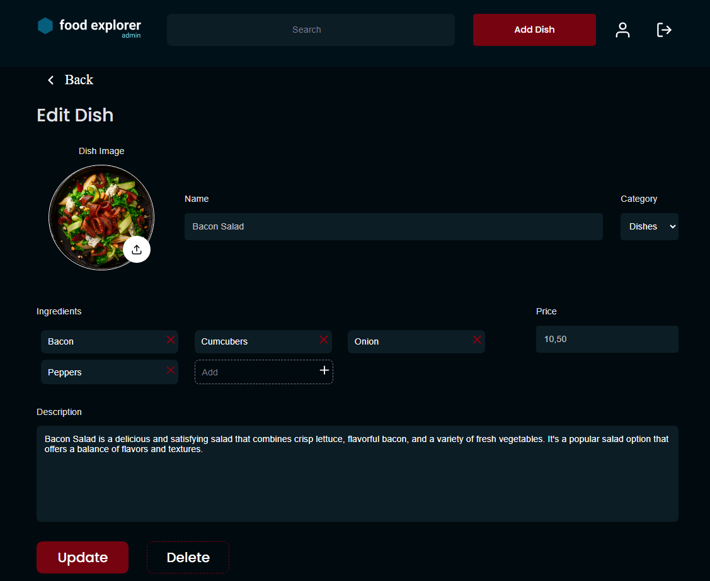

# Food Explorer

[Food Explorer Deployed](https://food-explorer-grl.netlify.app/)

## About

Food Explorer is a web application developed using technologies such as React.js on the front-end and Node.js [back-end](https://github.com/GabrielRiomar/backend_foodexplorer) that provides a browsing and food ordering experience for restaurant customers.

The administrator has access to create, edit, and delete dishes. New users need to register in order to use the services available on the platform.

## Techonologies

- axios
- react
- react-dom
- react-icons
- react-router-dom
- styled-components
- swiperjs
- vite

## How to use

Clone the project

```bash
git clone https://github.com/GabrielRiomar/food-explorer.git
```

Execute the front-end

```bash
# Install dependencies
npm install

# And then start the developer env
npm run dev

```

### Admin user to check it functionalities

`e-mail: admin@foodexplorer.com` `senha: admin1`

The server of this project has been hosted on Render, a free hosting service.
So it's important to point it out since being hosted on a free service, the back-end goes into a hibernation state after 15 minutes of inactivity. If a user tries to access the site and the back-end doesn't respond, it's necessary to wait for a moment as it will be "reinitializing" the services. This process can take up to 1 minute, depending on the server load on Render.

On the other hand, the front-end has been hosted on the Netlify platform, which allows hosting websites and web applications for free. For the front-end to work correctly, it's crucial that the back-end server is up and running and responding correctly. Otherwise, the front-end may display errors or unexpected behavior.

### User

- Homepage
  

- Details
  

### Admin

- Página home
  

- Editing item
  
